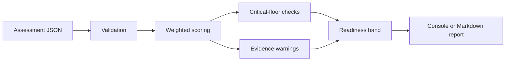

# AI Readiness Diagnostic

The [BBI AI Readiness Diagnostic Kit](https://github.com/Brilliant-Brainstorm-Intelligence-LLC/bbi-ai-readiness-diagnostic-kit) is a public, evidence-first toolkit for evaluating whether an organization is ready to pursue a **specific** AI use case. Release [v0.1.0](https://github.com/Brilliant-Brainstorm-Intelligence-LLC/bbi-ai-readiness-diagnostic-kit/releases/tag/v0.1.0) ships a working CLI, sample assessment, unit tests, CI, and documentation.

:::info Portfolio artifact

This page describes a **public repository**, not a live production service or compliance certification. Scores are decision aids—not guarantees, legal determinations, or substitutes for professional review.

:::

## Problem statement

Before building a model or selecting a vendor, teams should answer:

- What business decision should improve?
- What data is required, and is it trustworthy?
- Who owns human oversight when the system is wrong?
- What are the consequences of failure?
- What evidence justifies the next investment?

The diagnostic puts those questions first and produces a transparent score, dimension findings, missing-evidence warnings, and a bounded recommendation.

## Six assessment dimensions

| Dimension           | Weight | Critical floor |
| ------------------- | -----: | -------------- |
| Business value      |    20% | Yes            |
| Data readiness      |    20% | Yes            |
| Human oversight     |    15% | Yes            |
| Risk and governance |    15% | Yes            |
| Delivery readiness  |    15% | No             |
| Evidence quality    |    15% | Yes            |

Each dimension receives a score from 0–5 with supporting evidence items. A critical dimension below 2 prevents a `READY` result regardless of the weighted total.

## Processing pipeline



### Stage notes

1. **Validation** — Schema checks, required dimensions, score range enforcement.
2. **Weighted scoring** — Normalized 0–100 composite using explicit weights.
3. **Critical-floor checks** — Blocks `READY` when any critical dimension scores below 2.
4. **Evidence warnings** — Surfaces weak or missing evidence; no evidence forces `NOT READY`.
5. **Readiness band** — Maps score to `READY`, `CONDITIONAL`, `DISCOVERY`, or `NOT READY`.
6. **Report** — Console summary or Markdown output for stakeholder review.

## Readiness bands

|   Score | Band        | Interpretation                                                          |
| ------: | ----------- | ----------------------------------------------------------------------- |
|  85–100 | READY       | Ready for a bounded implementation plan, subject to identified controls |
| 70–84.9 | CONDITIONAL | Proceed only after named gaps are resolved or constrained               |
| 50–69.9 | DISCOVERY   | Limit work to discovery, evidence collection, or prototype validation   |
|  0–49.9 | NOT READY   | Do not begin implementation                                             |

## Quick start

Requirements: Python 3.11+, no third-party runtime dependencies.

```bash
git clone https://github.com/Brilliant-Brainstorm-Intelligence-LLC/bbi-ai-readiness-diagnostic-kit.git
cd bbi-ai-readiness-diagnostic-kit
python -m bbi_ai_readiness.cli examples/sample-assessment.json
python -m bbi_ai_readiness.cli examples/sample-assessment.json --output readiness-report.md
python -m unittest discover -s tests -v
```

Example console output from the shipped sample:

```text
Overall score: 69.2 / 100
Readiness band: CONDITIONAL
Recommendation: Proceed only with a bounded discovery or prototype phase.
```

## Architectural boundaries

The v0.1 implementation intentionally excludes:

- Model calls or external AI services
- Private data connectors
- Automated approval decisions
- Live compliance determination
- Persistence of assessment data

Runtime dependencies: **Python standard library only**.

## Governance boundary

The kit is a public educational and diagnostic aid. It does **not**:

- Certify regulatory or legal compliance
- Guarantee project success
- Replace security, privacy, financial, or domain review
- Connect to private operating systems or confidential records
- Present static example output as live operational telemetry

## Roadmap (from public repository)

**v0.1 (shipped):** scoring engine, JSON input, Markdown report, sample assessment, tests, CI, Apache-2.0 license, tagged release.

**v0.2 (planned):** interactive questionnaire, evidence traceability IDs, configurable dimension weights, side-by-side assessment comparison.

## Further reading

- [Repository README](https://github.com/Brilliant-Brainstorm-Intelligence-LLC/bbi-ai-readiness-diagnostic-kit)
- [PUBLIC_PROOF_GATE.md](https://github.com/Brilliant-Brainstorm-Intelligence-LLC/bbi-ai-readiness-diagnostic-kit/blob/main/PUBLIC_PROOF_GATE.md) — release checklist used before public launch
