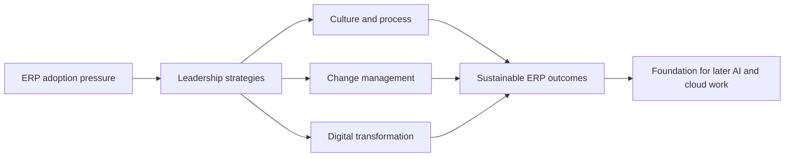
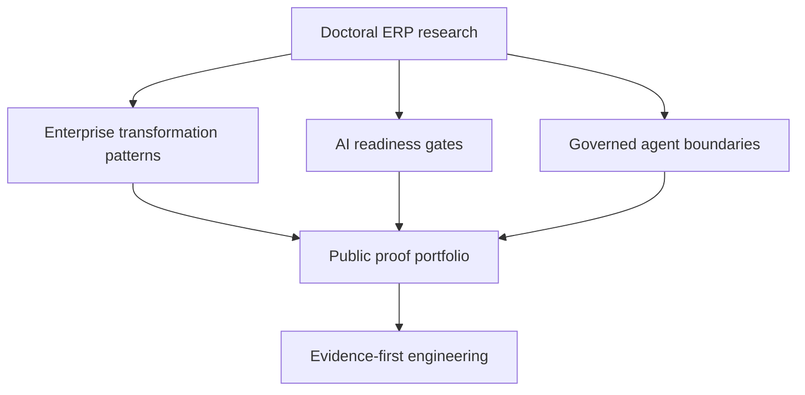

# Doctoral Research Overview

This portfolio is informed by doctoral research into **enterprise resource planning (ERP) implementation strategies** in small- and medium-sized manufacturing enterprises—and by subsequent enterprise experience applying those lessons in architecture, cloud, and AI governance contexts.

**Canonical source (Walden University ScholarWorks):**  
[Enterprise Resource Planning Implementation Strategies in Small- and Medium-sized Manufacturing Enterprises](https://scholarworks.waldenu.edu/dissertations/12693)  
Doctor of Business Administration · Walden University · April 2022

:::note Attribution and scope

Summaries on this site are written in original language for portfolio context. They do not reproduce dissertation text. For methodology, full findings, and citations, use the official Walden repository linked above. Patterns elsewhere on this site are informed by that research **and** later enterprise practice—not claimed as direct dissertation extracts.

:::

## Overview

The dissertation examined how manufacturing SME leaders successfully implement ERP systems when adoption risk is high and organizational capacity is constrained. The work was a qualitative multiple-case study grounded in **diffusion of innovation** theory, with data from ERP business leaders and supporting organizational documents.

Five thematic areas emerged around culture and process strategy, digital transformation and innovation diffusion, planning and leadership, change management, and implementation lessons learned. A central practical recommendation was that leaders must identify and address causes of resistance to organization-wide buy-in—not only technical cutover issues.



## Research problem

Manufacturing SMEs often struggle to execute ERP implementations in ways that stick. Failed or stalled programs threaten operational stability and the longevity of innovation initiatives. The research focused on **critical success factors and leadership strategies** used by firms that did implement successfully—rather than treating ERP failure as a purely technical problem.

## Why ERP implementations succeed or fail

In original summary form, the research and subsequent practice point to a consistent pattern:

| Dimension            | When it supports success                    | When it drives failure                 |
| -------------------- | ------------------------------------------- | -------------------------------------- |
| Culture and process  | Process design precedes tool worship        | Software installed on broken workflows |
| Leadership           | Visible ownership, planning, and escalation | Sponsorship in name only               |
| Change management    | Resistance causes identified early          | Training treated as a checkbox         |
| Innovation diffusion | Adoption paced to organizational readiness  | Big-bang hope without buy-in           |
| Lessons learned      | Feedback loops during and after go-live     | Same mistakes repeated next release    |

```text
Technical readiness
        │
        ▼
Organizational readiness  ──►  Adoption durability
        │
        ▼
Evidence of operating truth
```

ERP programs fail quietly when leaders optimize for go-live dates and ignore buy-in, data discipline, and process ownership. They succeed when leadership treats implementation as **organizational change with a technical core**.

## Practical findings

Practical takeaways that continue to shape this portfolio (stated as practice-informed principles, not verbatim findings):

1. **Resistance is diagnostic.** Organization-wide buy-in problems usually signal unclear ownership, process mismatch, or trust gaps—not “user stubbornness.”
2. **Culture and process strategy are first-order.** Tool selection without process clarity multiplies rework.
3. **Leadership and planning are inseparable from technology.** Diffusion of innovation depends on how leaders sequence communication, training, and decision rights.
4. **Change management is an operating control**, not a soft add-on after configuration.
5. **Implementation lessons must be captured.** Repeatable success requires evidence from what worked and what did not.

## Connection to enterprise transformation

ERP transformation pages on this site emphasize inventory truth, costing integrity, warehouse discipline, and data quality because those foundations determine whether modernization improves decisions—or merely accelerates bad ones. Doctoral research into manufacturing SME ERP strategies provides an early lens: **adoption durability depends on leadership, process, and resistance management**, not configuration alone.

See [ERP Transformation](/docs/erp-transformation/).

## Connection to AI readiness

AI and analytics amplify existing ERP and operational data quality. The research emphasis on readiness, buy-in, and evidence before claiming transformation success maps directly to an evidence-first AI readiness posture: clarify the decision, data fitness, accountable owner, and failure consequences before implementation spend.

See [AI Readiness Diagnostic](/docs/enterprise-ai/ai-readiness-diagnostic).

## Connection to governed AI systems

Governed AI systems require the same class of controls that ERP programs need for durable adoption: clear human authority, escalation paths, evidence trails, and explicit boundaries on automated action. The research focus on leadership, resistance, and organization-wide buy-in informs how this portfolio frames **human authority where consequences matter**.

See [Governed Agent Systems](/docs/enterprise-ai/governed-agent-systems) and [Engineering Principles](/docs/engineering-platform/engineering-principles).

## Lessons that continue to influence current engineering work



Lessons that still guide current public engineering work:

- Prefer **evidence before implementation claims**
- Treat **human authority and change ownership** as first-class architecture
- Design for **adoption durability**, not only technical completeness
- Keep **privacy and public-proof boundaries** explicit when sharing methodology
- Connect ERP foundations to later AI and cloud work without inventing causality the dissertation did not claim

## Official source

| Field       | Value                                                                                                       |
| ----------- | ----------------------------------------------------------------------------------------------------------- |
| Title       | Enterprise Resource Planning Implementation Strategies in Small- and Medium-sized Manufacturing Enterprises |
| Author      | Tatianna Gilliam                                                                                            |
| Degree      | Doctor of Business Administration                                                                           |
| Institution | Walden University                                                                                           |
| Year        | 2022                                                                                                        |
| Repository  | [scholarworks.waldenu.edu/dissertations/12693](https://scholarworks.waldenu.edu/dissertations/12693)        |

Do not rely on third-party mirrors or unofficial PDFs for citation. Use the Walden ScholarWorks page as the canonical public source.
